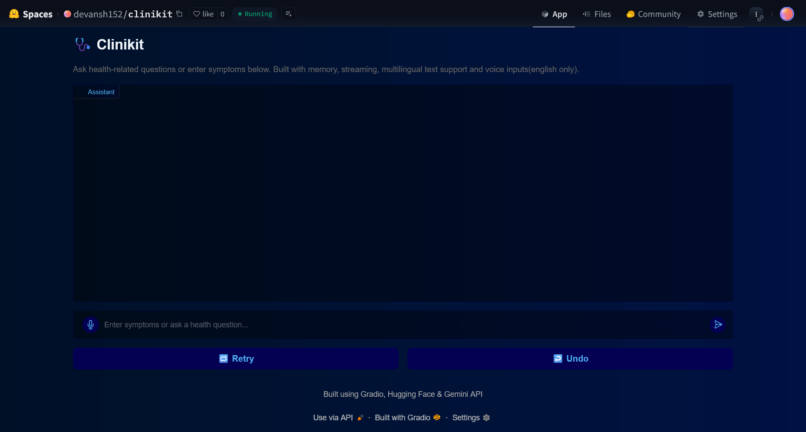

# 🩺 Clinikit – Multilingual AI Health Assistant

Clinikit is a real-time, multilingual AI chatbot that helps users identify possible diseases based on symptoms. Built using Retrieval-Augmented Generation (RAG), Gemini API, FAISS, and Gradio, it provides a lightweight, conversational interface for symptom analysis.

 <!-- Optional: Add image preview -->

## 🚀 Live Demo
👉 [Try it on Hugging Face Spaces](https://huggingface.co/spaces/devansh152/clinikit)  
*(No login required)*

---

## 🧠 Features

- ✅ **Multilingual Input Support**
- 🧠 **Retrieval-Augmented Generation (RAG)** using FAISS + Sentence Embeddings
- 🤖 **LLM Reasoning** powered by Gemini API
- 💬 **Conversational Interface** with memory (6-turn history)
- 🎙️ **Voice Input** support (English)
- 🔁 **Undo / Retry / Clear** buttons
- 📖 **Source Citations** for credibility
- 👍👎 **User Feedback** system

---

## 🏗️ Tech Stack

| Component | Tech |
|----------|------|
| Embedding Model | `BAAI/bge-base-en-v1.5` |
| Vector Search | FAISS |
| LLM | Gemini API |
| UI | Gradio |
| Deployment | Hugging Face Spaces |
| Languages | Python |

---

## 🧪 Example Queries

> **Input:** "What disease causes joint pain and stiffness?"  
> **Output:** Possible diseases (e.g., Osteoarthritis), description, treatment suggestions, and sources.

> **Input (Hindi):** "मुझे बुखार, खांसी और सांस लेने में तकलीफ हो रही है।"  
> **Output:** Translated → disease prediction (e.g., COVID-19), treatment, and source.

---

## ⚠️ Disclaimer

Clinikit is an experimental project and **not a substitute for professional medical advice, diagnosis, or treatment**. Always consult a qualified healthcare provider.

---

## 📁 Dataset

- Symptoms-to-disease mapping based on open-source health datasets.
- Custom enriched with Gemini-assisted descriptions and citations.

---

## 💡 Future Improvements

- Add image-based skin disease detection (planned)
- Enable persistent chat history
- Deploy mobile-first interface

---

## 🧑‍💻 Author

Built by [Devansh](https://github.com/kumardevansh)  
Feel free to reach out for feedback, collaborations, or ideas!

---

## 📜 License

MIT License
